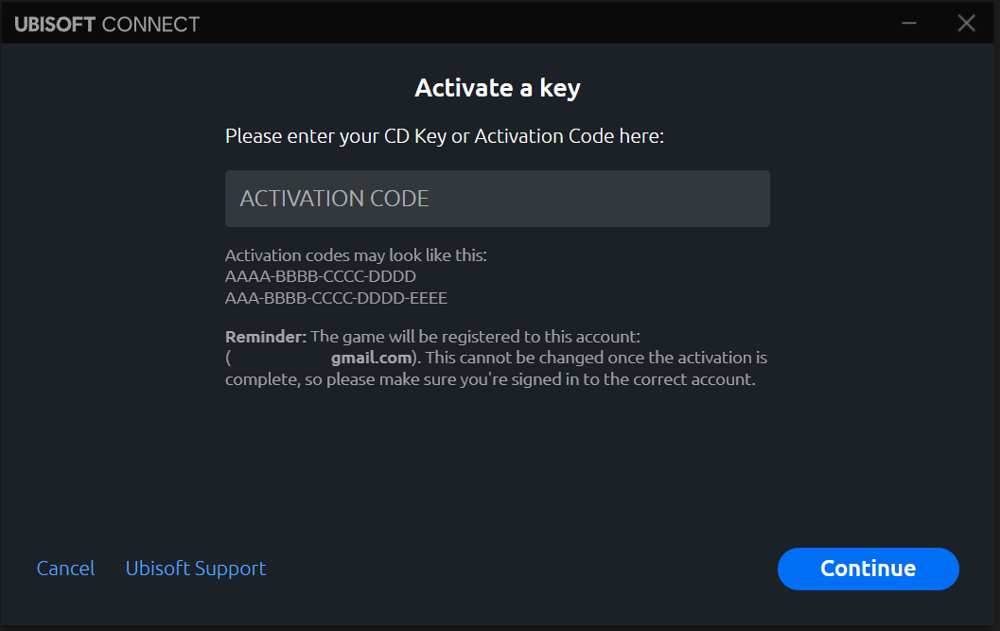
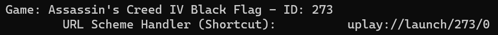

# Ubisoft - Uplay App/Game IDs on Windows  
  
Get Ubisoft - Uplay App/Game IDs from the Windows Registry for any installed games with the uplay://launch/{ID}/0 (URL Scheme Handler)  
  
#### Why would I ever need to use this?  
If you own any games from Ubisoft prior to the introduction of their "**Ubisoft+ Games Subscription**". Such as **Assassin's Creed® IV Black Flag™ Gold Edition**, etc...  
  
You could easily install your games along with its appropriate **"Desktop Shortcut"** that would allow you to launch the game.  
  
However, if you ever **Subscribed and/or Trialled out** their ***Ubisoft+ Subscription*** service and later **Cancelled** it while having played the certain old games in the Ubisoft+ Catalogue you would have noticed a different **App/Game ID** being used to refer and launch the game.  
  
  
  
#### Example:  
If you downloaded **Assassin's Creed® IV Black Flag™ Gold Edition** from your **owned** games library while not in an Active Ubisoft+ Subscription. The following Desktop Shortcuts are created:  
  
**Assassin's Creed IV Black Flag (Singleplayer)**  
```  
uplay://launch/565/0  
```  
  
**Assassin's Creed IV Black Flag (Multiplayer)**  
```  
uplay://launch/565/1  
```  
  
You will not be able to launch this game instead Ubisoft Connect will ask you to either **Login** and/or **Activate a key**  
  
  
To **FIX the ISSUE** you would need to know the **App/Game ID** when you installed the game from the Ubisoft Connect Launcher.  
  
Thus, running the **UplayGameIDs.py** will check the Windows Registry and retrieve ALL the Uplay App/Game ID as well as display the URL Scheme Handler used to launch that specific game.  
  
  
  
Changing the App/Game ID from **565 to 273** should fix any shortcut issues you have for this game and others....  
  
  
**Assassin's Creed IV Black Flag (Singleplayer)**  
```  
uplay://launch/273/0  
```  
  
**Assassin's Creed IV Black Flag (Multiplayer)**  
```  
uplay://launch/273/1  
```  
  
  
Alternative, you might want to fix the **Start Menu** shortcuts which also are affected by the same issue.  
Open **Run** using the **"Windows Key + R"** paste the below Path. Locate the Game shortcuts and modify the **Properties** to include the correct App/Game ID  
  
```  
%AppData%\Microsoft\Windows\Start Menu\Programs  
```  
  
**NOTE: Uplay uses the following URL Scheme Handler**  
uplay://launch/{**GAME_ID**}}/{**MODE**}  
  
**MODE** is a numerical value usual; **0 or 1**; for Singleplayer and Multiplayer respectively. However, certain games like **Tom Clancy's Rainbow Six Siege** uses this to launch either the **DX11** (0) or **Vulkan** (1)  
  
	uplay://launch/{GAME_ID}}/0 for Singleplayer  
	uplay://launch/{GAME_ID}}/1 for Multiplayer
